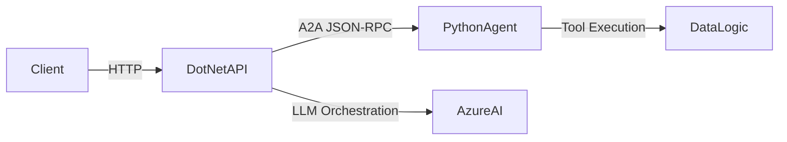
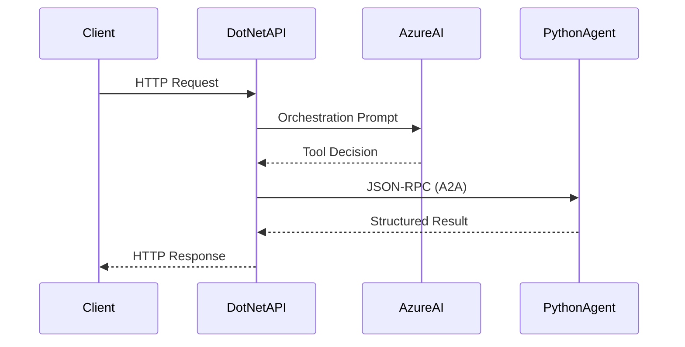
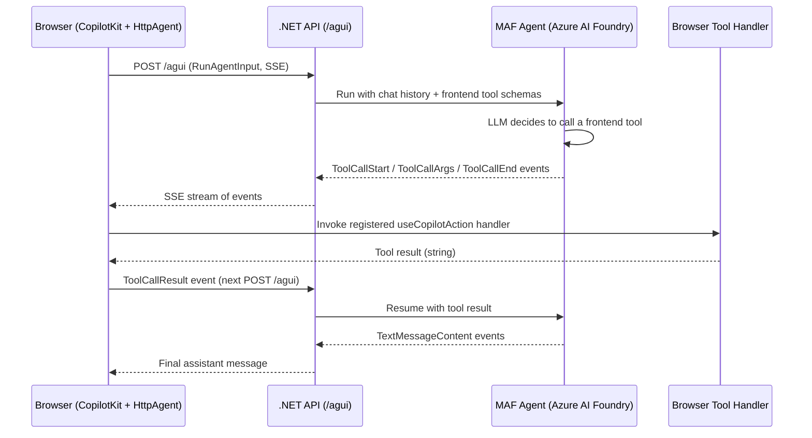
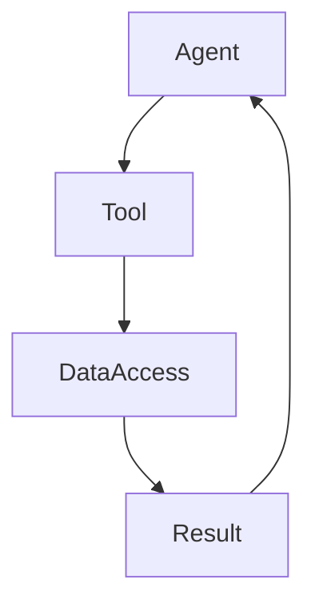
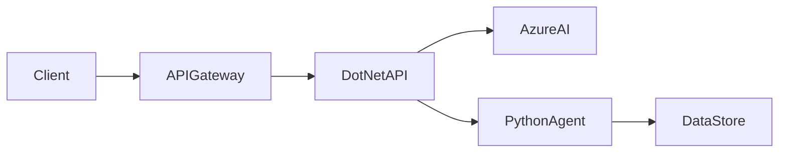
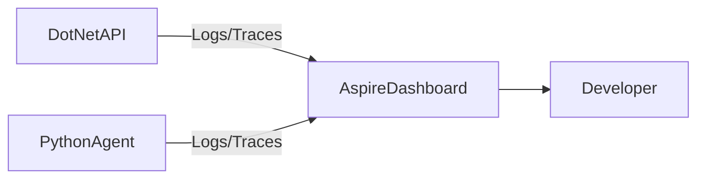
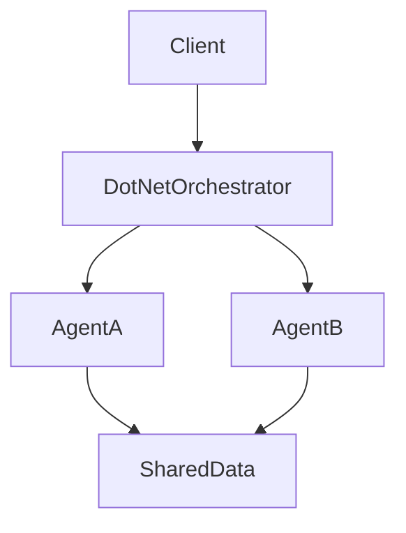

# Trial & Error – Aspire + A2A + Agents

Experimental distributed application built with **.NET + Python** using **.NET Aspire** and the **Agent‑to‑Agent (A2A)** protocol.  
It demonstrates orchestration from .NET into Python agents powered by Azure AI.

---

## What Is Built Here

- **Aspire AppHost** – Orchestrates all services locally
- **.NET API Service** – Entry point + agent orchestrator
- **Python Backend Service** – Hosts A2A agents
- **Azure AI Foundry integration** – LLM‑powered orchestration
- **In‑tool data access (Python)** – Data processing happens inside agent tools

Conceptually, this is a minimal distributed agent system:



---

## How To Run

### 1. Prerequisites

- [.NET 10 SDK](https://dotnet.microsoft.com/download)
- [Python 3.12+](https://www.python.org/downloads/)
- [uv](https://docs.astral.sh/uv/) (Python package manager)
- [.NET Aspire](https://learn.microsoft.com/dotnet/aspire/overview)

### Aspire / Environment Configuration Prerequisites

The following must be configured in **Aspire AppHost settings or user-secrets**:

- `Parameters:AiFoundryProjectEndpoint`
- `Parameters:ModelDeploymentName`

These are injected into the .NET API service via Aspire configuration binding.

If deploying beyond local development, ensure:

- Azure AI credentials are available as environment variables
- Services can resolve each other via Aspire service discovery
- Proper HTTP ports are exposed for A2A endpoints

### 2. Configure Azure AI Secrets

```bash
dotnet user-secrets set "Parameters:AiFoundryProjectEndpoint" "https://<your-project>.services.ai.azure.com/api/projects/<project-id>" --project src/dotnet/AspireTrial.AppHost

dotnet user-secrets set "Parameters:ModelDeploymentName" "gpt-4o" --project src/dotnet/AspireTrial.AppHost
```

Configuration model:  
`src/dotnet/AspireTrial.ApiService/Options/AzureAIOptions.cs`

More info:  
https://learn.microsoft.com/azure/ai-studio/

### 3. Install Python Dependencies

```bash
cd src/python
uv sync --all-groups
```

This creates `.venv` and installs runtime + dev dependencies.

### 4. Run Aspire

```bash
aspire run
```

Aspire starts:

- AppHost
- .NET API
- Python backend

---

## How The Projects Work Together

### High-Level Flow

```
Client
  ↓
.NET API (Orchestrator)
  ↓  (A2A - JSON-RPC 2.0)
Python Agent
  ↓
Tool / Data Logic
```

### .NET → Python Invocation

1. Client calls `.NET` endpoint (e.g., `/countLetters-a2a`).
2. .NET uses Azure AI to determine intent / orchestration.
3. .NET discovers the Python agent via its **Agent Card**.
4. .NET invokes the agent using **A2A (JSON-RPC 2.0 over HTTP)**.
5. Python executes tool logic and returns structured result.

Relevant files:

- .NET orchestrator:  
  `src/dotnet/AspireTrial.ApiService/Services/AgentCollaboration.cs`
- Python agent router:  
  `src/python/src/aspire_backend_service/routers/agents.py`

---

## A2A Implementation

This project uses Microsoft’s **Agent‑to‑Agent (A2A)** protocol:

https://github.com/microsoft/agents

### Python Agent

- JSON-RPC endpoint:  
  `/agents/count-letters-a2a`
- Agent card:  
  `/agents/count-letters/.well-known/agent-card.json`

The **Agent Card** enables discovery and describes:

- Capabilities
- Input/output schema
- Invocation endpoint

### .NET Orchestrator

The .NET service:

- Fetches the agent card
- Constructs a JSON-RPC request
- Sends invocation over HTTP
- Handles structured response

This keeps services loosely coupled and independently deployable.

### Sequence Diagram – End-to-End A2A Call



---

## React + CopilotKit Frontend Tools

A standalone React app (Vite + TypeScript) at `src/react/copilot-frontend/` provides a chat UI backed by the **same .NET API service**. It demonstrates **browser-side tools** — capabilities the agent can invoke in the user's browser without any Node.js sidecar — by speaking the **AG-UI** protocol directly to a Microsoft Agent Framework (MAF) agent hosted in `AspireTrial.ApiService`.

### Why This Matters

Traditional CopilotKit setups place a Node "runtime" between the browser and the agent. With AG-UI's first-party .NET hosting (`Microsoft.Agents.AI.Hosting.AGUI.AspNetCore`), the browser connects straight to the .NET endpoint over Server-Sent Events. This:

- Removes an entire process from the topology
- Keeps agent orchestration and frontend tooling in one runtime
- Lets the .NET API expose both A2A (server-to-server) and AG-UI (browser-to-server) protocols from the same agent

### Architecture



### The Three Frontend Tools

Registered in the React app as CopilotKit actions; their schemas are advertised to the agent via the AG-UI handshake.

| Tool | Signature | Behaviour |
| --- | --- | --- |
| `showToast` | `(message: string, level: "info" \| "success" \| "warning" \| "error")` | Renders a toast via `react-hot-toast`. Returns confirmation string. |
| `askUserConfirmation` | `(question: string)` | Renders a modal dialog (focus-trapped, Enter/Escape). Returns `"confirmed"` or `"cancelled"`. |
| `showWeather` | `(city: string)` | Geocodes via Open-Meteo, fetches current weather, renders a card. Returns one-line summary. |

Source: `src/react/copilot-frontend/src/tools/`.

### How To Run

The React app is wired into Aspire as a `ViteApp` resource. `aspire run` boots it alongside the .NET API and Python backend, with `VITE_AGUI_URL` injected automatically:

```bash
aspire run
```

Open the Aspire dashboard, locate the **`copilot-react`** resource, and click its allocated URL. Then try prompts like:

- "Show me a success toast saying deployment finished"
- "Confirm with the user before proceeding with the rollback"
- "What's the weather in Amsterdam?"

#### Standalone Dev (Without Aspire)

If you want to run the React app on its own (e.g. `npm run dev`), set `VITE_AGUI_URL` to point at a running .NET API:

```bash
cd src/react/copilot-frontend
VITE_AGUI_URL=http://localhost:5001/agui npm run dev
```

(The `.env.example` file is intentionally excluded from version control by the project's edit policy — set the variable inline or in your shell.)

### Manual Smoke Test

A canonical AG-UI request is included in the shared HTTP test file at `src/shared/api-tests.http` under the `### AG-UI smoke test` section. Send it from any REST client that supports SSE (e.g. the VS Code REST Client extension) to verify the `/agui` endpoint independently of the React app.

### End-to-End Tests

Playwright specs live at `src/react/copilot-frontend/tests/e2e/`. They mock the AG-UI endpoint and Open-Meteo APIs via `page.route()` so they run deterministically without a live backend:

```bash
cd src/react/copilot-frontend
npm run test:e2e            # headless
npm run test:e2e:headed     # with visible browser for debugging
```

### Relevant Files

- `src/dotnet/AspireTrial.ApiService/Program.cs` — `AddAGUI()`, singleton `AIAgent`, `MapAGUI("/agui", agent)`
- `src/dotnet/AspireTrial.ApiService/Services/FrontendDemoAgent.cs` — agent instructions + `get_server_time` server-side tool
- `src/dotnet/AspireTrial.AppHost/AppHost.cs` — `AddViteApp("copilot-react", …)` wiring with `VITE_AGUI_URL`
- `src/react/copilot-frontend/src/App.tsx` — `<CopilotKit>` provider + `HttpAgent` + tool mounts
- `src/react/copilot-frontend/src/tools/` — the three `useCopilotAction` hooks

---

## Agent Capabilities

Current example:

### `CountLettersAgent`

- Receives text
- Counts letters
- Returns structured result

This is intentionally simple but demonstrates:

- Agent discovery
- Cross-runtime invocation (.NET → Python)
- Tool-based execution
- LLM-assisted orchestration

The system can be extended with:

- Additional Python agents
- Domain-specific tools
- Multi-agent collaboration

---

## Data Access In Python (In-Tool Execution)

The Python backend follows a **tool-centric design**:

- Agents expose capabilities
- Tools perform actual computation / data logic
- Data access happens inside tools

Conceptually:



Benefits:

- Clear separation of orchestration vs execution
- Testable tool layer
- Replaceable data sources
- Safer LLM integration (bounded capabilities)

This pattern aligns with modern agent architectures used in:

- Azure AI Foundry Agents
- Tool-calling LLM systems

---

## Summary

This repository demonstrates:

- A distributed Aspire application
- .NET orchestrating Python agents
- A2A-based agent discovery and invocation
- Azure AI–powered orchestration
- Tool-based execution with in-process data access

After reading this, an engineer should understand:

1. How to run the system locally
2. How .NET invokes Python via A2A
3. Where orchestration vs execution lives
4. How agents and tools are structured
5. How to extend the system with new agents

Use this as a foundation for experimenting with cross-runtime, multi-agent systems.

---

## Production Architecture (Conceptual)

In a production setting, services are independently scalable and deployable.



Possible hosting options:

- Azure Container Apps
- AKS (Kubernetes)
- Azure App Service (mixed runtime)

Key characteristics:

- Independent scaling of .NET and Python services
- Centralized AI configuration
- A2A over internal service network
- Secure environment variable injection for secrets

This separation ensures the system remains loosely coupled while enabling horizontal scaling and independent evolution of agents.

---

## Observability (Aspire + Logging)

.NET Aspire provides built-in observability for local development:

- Centralized logs
- Distributed tracing
- Service health monitoring
- Dependency visualization

When running `aspire run`, open the Aspire dashboard to:

- Inspect inter-service HTTP calls
- View A2A JSON-RPC requests
- Monitor startup dependencies

Conceptually:



In production, integrate with:

- Azure Monitor
- Application Insights
- OpenTelemetry collectors

Both .NET and Python services can emit structured logs and traces for full distributed visibility.

---

## Multi-Agent Collaboration (Conceptual Extension)

The current implementation demonstrates a single Python agent.  
The architecture supports multiple agents collaborating via A2A.



Example scenario:

- Agent A: Text analysis
- Agent B: Data enrichment
- Orchestrator decides execution order
- Results aggregated and returned

Because A2A is protocol-based and runtime-agnostic:

- Agents may be written in different languages
- Agents may live in separate deployments
- Orchestration logic remains centralized (or delegated)

This enables scalable, domain-specific, distributed AI systems built from composable agents.

---

## Local Debugging Walkthrough

This section explains how to debug the system end-to-end during development.

### 1. Start The System

```bash
aspire run
```

Open the Aspire dashboard to observe:

- Service startup order
- HTTP traffic between services
- Logs and traces

---

### 2. Debugging the .NET Orchestrator

1. Open the solution in your IDE.
2. Set a breakpoint in:
   `src/dotnet/AspireTrial.ApiService/Services/AgentCollaboration.cs`
3. Trigger the endpoint (e.g., `/countLetters-a2a`).

You can inspect:

- The orchestration prompt
- The fetched agent card
- The constructed JSON-RPC payload
- The structured response from Python

---

### 3. Debugging the Python Agent

1. Open:
   `src/python/src/aspire_backend_service/routers/agents.py`
2. Set breakpoints in the agent handler or tool logic.
3. Re-trigger the .NET endpoint.

You can inspect:

- Incoming JSON-RPC request
- Parsed parameters
- Tool execution logic
- Returned structured result

---

### 4. Inspecting A2A Traffic

Using Aspire dashboard or logs, verify:

- JSON-RPC 2.0 request structure
- Method name and params
- Response `result` vs `error`

You can also manually test the Python agent:

```bash
curl http://localhost:<python-port>/agents/count-letters-a2a \
  -H "Content-Type: application/json" \
  -d '{"jsonrpc":"2.0","id":"1","method":"invoke","params":{"text":"hello"}}'
```

---

### 5. Common Debugging Points

- ✅ Agent card URL reachable
- ✅ JSON-RPC schema matches expected input
- ✅ Azure AI configuration correctly injected
- ✅ Services resolve via Aspire service discovery

This layered debugging approach (Client → .NET → A2A → Python → Tool) makes it easy to isolate issues in distributed agent systems.
